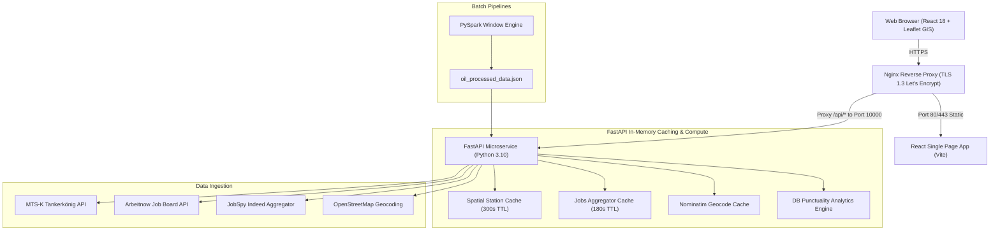

# Datenlens GERMANY 🇩🇪

[](https://datenlens.de)
[](https://fastapi.tiangolo.com)
[](https://react.dev)
[-E25A1C?style=for-the-badge&logo=apachespark)](https://spark.apache.org)
[](https://docker.com)
[](https://letsencrypt.org)

> **Live Production Platform:** [https://datenlens.de](https://datenlens.de)  
> **Lead Software Engineer & Data Analyst:** [Hosein Madani](https://www.linkedin.com/in/hossein-madani-f)  

---

## 🌟 Platform Overview

**Datenlens** is a production-grade full-stack real-time analytics platform delivering mobility, energy, housing, public transit, and career intelligence across Germany.

---

## 🎯 Key Intelligence Modules

1. **⛽ Live Fuel Price Monitor & Interactive GIS Map:**
   - Real-time MTS-K official gas station prices (Super E5, Super E10, Diesel).
   - In-memory spatial TTL caching (~1km coordinate resolution) to maximize hit ratios under API limits.
   - Interactive Leaflet GIS mapping with live browser GPS geolocation detection.

2. **🚆 Deutsche Bahn (DB) Punctuality & Delay Intelligence:**
   - Complete delay distribution metrics across all 40 major German Hauptbahnhöfe (>200,000 population).
   - Objective weighted delay model applying a **120-minute (2-hour) cancellation penalty**.
   - Stacked visual breakdown for delays (<5m, 5-15m, 15-30m, >30m, Cancelled).

3. **🏢 German Housing & Rent Index:**
   - Cold rent (*Kaltmiete*), warm rent (*Warmmiete*), and utilities (*Nebenkosten*) metrics across 16 Federal States and 14 metropolitan cities.
   - Interactive Rent Calculator calculating warm rent obligations and minimum net income under the 30% rent rule.

4. **🎯 Tech Jobs Radar (English-Friendly Aggregator):**
   - Live job aggregator combining the Arbeitnow Job Board API with multi-threaded JobSpy Indeed scraping.
   - Language Gatekeeper algorithm filtering out strict German fluency requirements (`C1`, `C2`, `verhandlungssicher`, `fließend`) and using `langdetect` N-gram classification.
   - Dynamic lookback filters (12h, 24h, 72h) with instant apply action links.

5. **📈 Energy Markets & 24-Hour Refuel Cycle:**
   - PySpark rolling 7-day Simple Moving Average on crude oil commodities.
   - 24-hour systematic price cycle analysis identifying the 18:00 – 21:00 refuel savings window (~€8 per tank).
   - German Renewable Power Grid generation mix (SMARD OpenData).

6. **👤 Engineering Portfolio:**
   - Professional biography, architecture breakdowns, technical skills matrix, and interactive CV of Hosein Madani.

---

## 🏗️ Architecture & Tech Stack



---

## 📡 REST API Reference

| Endpoint | Method | Params | Description |
| :--- | :---: | :--- | :--- |
| `/api/jobs` | `GET` | `query` (str), `hours` (12, 24, 72) | English-friendly German tech job listings |
| `/api/gas-stations` | `GET` | `lat` (float), `lng` (float), `rad` (float) | MTS-K real-time station prices & analytics |
| `/api/geocode` | `GET` | `q` (str) | OpenStreetMap Nominatim German geocoding |
| `/api/db-punctuality` | `GET` | *None* | 40 German rail hubs punctuality & delay stats |
| `/api/housing-data` | `GET` | *None* | German rental indices for states & cities |
| `/api/oil-data` | `GET` | *None* | PySpark processed crude oil time-series |

For full algorithmic details, mathematical formulas, and data schemas, please refer to [SYSTEM_ARCHITECTURE_AND_FEATURE_GUIDE.md](./SYSTEM_ARCHITECTURE_AND_FEATURE_GUIDE.md).

---

## 🚀 Deployment Pipeline

The platform uses a strict 3-step production pipeline:
1. **Local Development & Verification:** Verify FastAPI backend on port 10000 and run Vite build (`npm run build`).
2. **EC2 Sync:** Synchronize source files to AWS EC2 (`16.171.169.68`) via SCP using SSH PEM key.
3. **No-Cache Docker Build:** Rebuild and launch multi-stage backend and frontend containers with TLS 1.3 Let's Encrypt SSL proxy.

```bash
# Run backend locally
uvicorn main:app --port 10000 --host 0.0.0.0

# Deploy to EC2
scp -i ~/aws/datenlens-key.pem main.py requirements.txt ubuntu@16.171.169.68:~/datenlens/
scp -i ~/aws/datenlens-key.pem src/App.jsx src/App.css ubuntu@16.171.169.68:~/datenlens-frontend/src/
```

---

## 👤 Lead Engineer

**Hosein Madani**  
- **Role:** Data Analyst & Biomedical Data Engineer  
- **Education:** M.Sc. Medical Imaging & Data Processing, Friedrich-Alexander-Universität Erlangen-Nürnberg (FAU)  
- **LinkedIn:** [linkedin.com/in/hossein-madani-f](https://www.linkedin.com/in/hossein-madani-f)  
- **Email:** hoseinmadani74@gmail.com  
