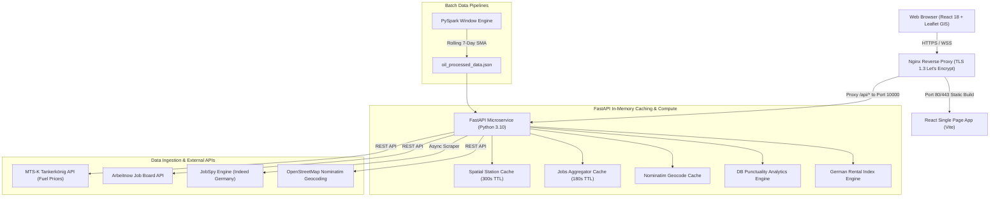

# Datenlens Platform: System Architecture & Technical Specification

> **Production URL:** [https://datenlens.de](https://datenlens.de)  
> **Lead Engineer:** Hosein Madani (Data Analyst & Biomedical Data Engineer)  
> **Platform Version:** 1.3.0 (Production AWS EC2)  

---

## 1. Executive Platform Overview

**Datenlens** is a full-stack real-time analytics and data intelligence platform engineered to address everyday mobility, infrastructure, cost-of-living, and career decisions across Germany.

The platform continuously integrates, processes, and visualizes multi-domain open data streams:
1. **Real-Time Fuel Monitoring:** MTS-K official gas station prices with spatial proximity clustering and GPS detection.
2. **Rail Transit Intelligence:** Deutsche Bahn (DB) delay distribution and punctuality analytics across all 40 major German rail hubs (>200,000 population) with a 2-hour cancellation penalty model.
3. **Rental Index & Living Cost Calculator:** Municipal and state-level housing benchmarks with dynamic rent and net income estimation.
4. **Energy Commodities & Grid Analytics:** PySpark rolling time-series analysis for crude oil, renewable energy share, and intra-day fuel price cycle optimization.
5. **Tech Jobs Radar:** Real-time job aggregator filtering English-friendly data and tech opportunities in Germany, removing strict German fluency hurdles.
6. **Engineering Portfolio:** Production showcase and resume for Hosein Madani.

---

## 2. End-to-End System Architecture



---

## 3. Detailed Module & Algorithm Breakdown

### Module 1: Real-Time Fuel Price Monitor & Interactive GIS Map

#### Purpose & Data Source
Integrates official German fuel market data from the **Market Transparency Unit for Fuels (MTS-K / Tankerkönig)** to provide real-time prices for **Super E5**, **Super E10**, and **Diesel** across Germany.

#### Key Endpoints
- `GET /api/gas-stations?lat=...&lng=...&rad=...`
- `GET /api/geocode?q=...`

#### Core Algorithm: Spatial Coordinate Resolution Caching
To prevent API rate-limit exhaustion while guaranteeing sub-millisecond response times:
1. **Spatial Key Normalization:** Coordinates are rounded to ~1km spatial resolution:
   `cache_key = f"{round(lat, 2)}_{round(lng, 2)}_{round(rad, 1)}"`
2. **In-Memory TTL:** Cached records expire after 300 seconds (5 minutes).
3. **Statistical Analytics:** The backend computes open station counts, minimum price markers, and arithmetic price averages in real time.

---

### Module 2: Deutsche Bahn (DB) Punctuality & Delay Intelligence

#### Purpose & Scope
Provides operational transparency across all **40 major German Hauptbahnhöfe (main rail stations)** in cities with populations exceeding 200,000.

#### Key Endpoint
- `GET /api/db-punctuality`

#### Algorithm: 120-Minute Weighted Delay & Punctuality Model
Standard DB punctuality definitions classify any train delayed by less than 5 minutes as "on-time" and omit cancelled trains from delay calculations. Datenlens implements an objective weighted passenger delay metric with a **120-minute (2-hour) cancellation penalty**:

$$\text{Avg Delay (min)} = \frac{(P_{<5\text{m}} \times 1.5) + (P_{5-15\text{m}} \times 9.0) + (P_{15-30\text{m}} \times 22.0) + (P_{>30\text{m}} \times 45.0) + (P_{\text{cancel}} \times 120.0)}{100}$$

Where:
- $P_{<5\text{m}}$: On-Time Trains (representative weight: $1.5\text{ min}$)
- $P_{5-15\text{m}}$: Minor Delay (representative weight: $9.0\text{ min}$)
- $P_{15-30\text{m}}$: Moderate Delay (representative weight: $22.0\text{ min}$)
- $P_{>30\text{m}}$: Severe Delay (representative weight: $45.0\text{ min}$)
- $P_{\text{cancel}}$: Cancelled Trains / Ausfälle (penalty weight: $120.0\text{ min}$)

The UI renders stacked delay distribution visualizers, ranking stations from most reliable (e.g. Freiburg, Kiel) to most congested (e.g. Köln Hbf, Frankfurt Hbf).

---

### Module 3: German Housing & Rental Market Analytics

#### Purpose
Analyzes regional cold rent (*Kaltmiete*), warm rent (*Warmmiete*), and utilities (*Nebenkosten*) across 16 Federal States and 14 metropolitan cities.

#### Key Endpoint
- `GET /api/housing-data`

#### Algorithm: Interactive Rent & Net Income Estimator
Calculates estimated monthly obligations and verifies housing affordability according to the **30% maximum rent-to-income rule**:

$$\text{Estimated Kaltmiete} = \text{Apartment Area } (m^2) \times \text{Rate}_{\text{kalt}} (€/m^2)$$
$$\text{Estimated Nebenkosten} = \text{Apartment Area } (m^2) \times \text{Rate}_{\text{neben}} (€/m^2)$$
$$\text{Total Warmmiete} = \text{Estimated Kaltmiete} + \text{Estimated Nebenkosten}$$
$$\text{Recommended Min Net Income} = \frac{\text{Total Warmmiete}}{0.30}$$

---

### Module 4: Energy Markets, PySpark Engine & Intra-Day Cycles

#### Purpose
Examines macroeconomic crude oil commodity trends, German renewable grid generation, and intra-day fuel pricing fluctuation cycles.

#### Key Endpoint
- `GET /api/oil-data`

#### Algorithms
1. **PySpark Window Processing:** Daily batch pipeline computing 7-day Simple Moving Averages over WTI crude oil closing prices using Spark SQL window functions:
   ```python
   windowSpec = Window.orderBy("date").rowsBetween(-6, 0)
   df = df.withColumn("sma_7", F.avg("price").over(windowSpec))
   ```
2. **24-Hour Price Cycle Optimizer:** Systematically models the 15–20 cent intra-day price swings in Germany, identifying the **18:00 – 21:00** sweet spot that yields average savings of ~€8 per 50L tank.
3. **Renewable Grid Integration:** Tracks clean energy generation share from SMARD OpenData benchmarks (Wind, Solar, Biomass, Hydro).

---

### Module 5: Tech Jobs Radar (English-Friendly Aggregator)

#### Purpose
Aggregates tech and data opportunities in Germany while removing strict German fluency hurdles (`C1`, `C2`, `verhandlungssicher`, `fließend`) for international data scientists, software engineers, and analysts.

#### Key Endpoint
- `GET /api/jobs?query=Data+Analyst&hours=24`

#### Algorithm: Multi-Tier Language Gatekeeper & Aggregation
1. **Data Ingestion:** Asynchronously combines the Arbeitnow Job Board API with multi-threaded JobSpy Indeed scraping targeting Germany.
2. **Strict Fluency Exclusion Regex:**
   ```python
   GERMAN_FLUENCY_REGEX = re.compile(
       r'(c1|c2|verhandlungssicher\w*|flie[ßs]end\w*)',
       re.IGNORECASE
   )
   ```
   Listings containing explicit requirements for near-native or fluent German are immediately discarded.
3. **N-Gram Language Detection:** `langdetect` classifies the text body; listings in English or without strict German barriers are verified.
4. **Geographic Filtering:** Enforces Germany and Remote job classifications, filtering out non-German locations.
5. **Time Window Filter & Caching:** Filters by creation cutoff (12h, 24h, 72h) with an in-memory 180s cache keyed by query and lookback window.

---

## 4. REST API Specification

| Endpoint | Method | Query Parameters | Description | Sample Output Key |
| :--- | :---: | :--- | :--- | :--- |
| `/api/train-delay-forecast` | `GET` | `origin` (str), `destination` (str), `weather` (str), `hour` (int 0-23), `day_type` (weekday/weekend) | Predictive corridor delay risk, on-time probability, and advisory | `{"success": true, "forecast": {"delay_probability_pct": 82.5, "risk_level": "Severe", ...}}` |
| `/api/jobs` | `GET` | `query` (str), `hours` (12, 24, 72) | English-friendly German tech job listings | `{"success": true, "count": 8, "jobs": [...]}` |
| `/api/gas-stations` | `GET` | `lat` (float), `lng` (float), `rad` (float) | MTS-K real-time station prices & analytics | `{"success": true, "analytics": {...}, "stations": [...]}` |
| `/api/geocode` | `GET` | `q` (str, min 2 chars) | German city/postal code geocoding | `{"success": true, "results": [...]}` |
| `/api/db-punctuality`| `GET` | *None* | 40 German rail hubs punctuality & delay stats | `{"summary": {...}, "top_10_best": [...], "all_stations": [...]}` |
| `/api/housing-data` | `GET` | *None* | German rental indices for states & cities | `{"summary": {...}, "cities": [...], "states": [...]}` |
| `/api/oil-data` | `GET` | *None* | PySpark processed crude oil time-series | `[{"Date": "2026-08-20", "Close": 78.5, "SMA_5": 77.2}]` |

---

## 5. Client-Side Routing & Deep Linking (HTML5 History)

| Route Path | Aliases | Target View & Purpose |
| :--- | :--- | :--- |
| `/fuel_price` | `/`, `/fuel`, `/fuel-price`, `/gas` | MTS-K Live Fuel Map & Price Monitor |
| `/trains` | `/db-delays`, `/train-delays`, `/delays` | DB Punctuality & AI Corridor Delay Forecaster |
| `/housing` | `/rent`, `/mietspiegel`, `/housing-market` | German State & City Rental Index Calculator |
| `/jobs` | `/tech-jobs`, `/jobs-radar`, `/career` | English-Friendly Tech Jobs Radar |
| `/energy` | `/markets`, `/dashboard`, `/oil` | Energy Grid & PySpark Crude Oil Analytics |
| `/aboutus` | `/portfolio`, `/about`, `/resume` | Engineering Portfolio & Lead Resume |

---

## 6. Deployment Pipeline & Infrastructure

The project strictly follows an automated 3-step deployment pipeline:

```
[Local Dev & Verification]  ──>  [EC2 Synchronization]  ──>  [No-Cache Container Build & Test]
  - Backend Port 10000             - SCP files via PEM Key      - Docker rebuild (Nginx + Uvicorn)
  - Frontend Vite Build            - 16.171.169.68              - Live Curl & HTTPS verification
```

### Production Environment
- **Host:** AWS EC2 Ubuntu Server (`16.171.169.68`)
- **Web Server:** Nginx with Let's Encrypt TLS 1.3 certificates (`try_files $uri $uri/ /index.html;`)
- **Containerization:** Docker multi-stage builds (`node:20-alpine`, `python:3.10-slim`, `nginx:alpine`)
- **Process Management:** Uvicorn ASGI server with async worker pools
